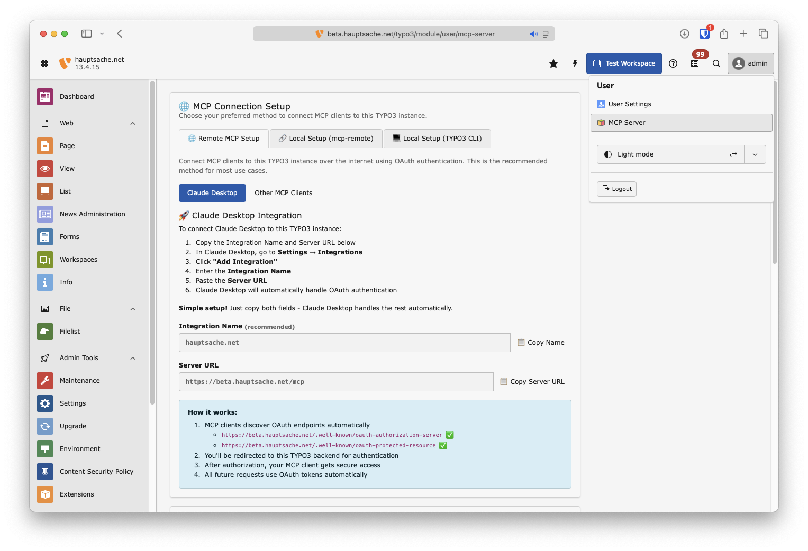

# TYPO3 MCP Server Extension

**⚠️ This extension is a work in progress and under active development.**

This extension provides a Model Context Protocol (MCP) server implementation for TYPO3 that allows
AI assistants to safely view and manipulate TYPO3 pages and records through TYPO3's workspace system.

## 🔒 Safe AI Content Management with Workspaces

**All content changes are automatically queued in TYPO3 workspaces**, making it completely safe for AI assistants to create, update, and modify content without immediately affecting your live website. Changes require explicit publishing to become visible to site visitors.

## What Can You Do?

With the TYPO3 MCP Server, your AI assistant can help you:

### 📝 **Content Management**
- **Translate Pages**: "Translate the /about-us page to German" - The AI reads your content, translates it, and creates proper language versions
- **Import Documents**: "Create a news article from this Word document" - Transform external documents into TYPO3 content with proper structure
- **Bulk Updates**: "Update all product descriptions to include our new sustainability message" - Make consistent changes across multiple pages

### 🔍 **Content Analysis & SEO**
- **SEO Optimization**: "Add meta descriptions to all pages that don't have them" - Automatically generate missing SEO content based on page content
- **Tone Analysis**: "Review the tone of our product pages and make them more friendly" - Get suggestions for improving content voice and style
- **Content Audit**: "Find all pages mentioning our old company name" - Quickly locate content that needs updating

### 🚀 **Productivity Boosters**
- **Template Application**: "Apply our standard legal disclaimer to all service pages" - Consistently apply content patterns
- **Content Migration**: "Copy all news articles from 2023 to the archive folder" - Reorganize content efficiently
- **Multi-language Management**: "Ensure all German pages have English translations" - Identify and fill translation gaps

All these operations happen safely in workspaces, giving you full control to review before publishing!

> 💡 **Want to know how it works?** Check out our [Technical Overview](TECHNICAL_OVERVIEW.md) for detailed information about the implementation, available tools, and real-world examples with actual tool calls.

## Project Status

| Feature                    | Status          | Notes                                                                                                         |
  |----------------------------|-----------------|---------------------------------------------------------------------------------------------------------------|
| **MCP Connection**         | ✅ Ready         | HTTP and stdin/stdout protocols (thanks to [logiscape/mcp-sdk-php](https://github.com/logiscape/mcp-sdk-php)) |
| **Authentication**         | ✅ Ready         | OAuth for Backend Users                                                                                       |
| **Page Tree Navigation**   | ✅ Ready         | Page tree view similar to the TYPO3 backend                                                                   |
| **Page Content Discovery** | ✅ Ready         | Similar to the List or Page module with backend layout support                                                |
| **Record Reading/Writing** | ✅ Ready         | Read and write any workspace-capable TYPO3 table (core & extensions) with full schema inspection              |
| **Content Translation**    | ⚠️ Experimental | Implemented, needs real-world testing                                                                         |
| **Fileadmin Support**      | ❌ Missing       | Not yet implemented                                                                                           |
| **Workspace Selection**    | ❌ Missing       | Currently uses the first writable workspace of the user                                                       |

While there are a lot of automated tests, and even some [LLM test](Tests/Llm/README.md), TYPO3 instances are widely different and Language Models are also widely different. Feel free to [create issues here on GitHub](https://github.com/logiscape/mcp-sdk-php/issues) or [share experiences in the typo3-core-ai channel](https://typo3.slack.com/archives/C091M0M7BL6). 

## Installation

```bash
composer require hn/typo3-mcp-server
```

**Requirements:**
- TYPO3 v13.4+
- TYPO3 Workspaces extension (automatically installed as dependency)

## Usage

### Quick Start

There are two ways to connect AI assistants like Claude Desktop to your TYPO3 installation:

#### Option 1: OAuth Authentication (Recommended)

For secure remote access with proper authentication:

1. Go to **[Username] → MCP Server** in your TYPO3 backend
2. Copy the Server URL (and optionally the Integration Name)
3. Add the Integration to whatever MCP Client you are using.



#### Option 2: Local Command Line Connection

This method gives you admin privileges by default. Add this to your mcp config file of Claude Desktop or whatever client you are using.
```json
{
   "mcpServers": {
      "[your-typo3-name]": {
         "command": "php",
         "args": [
            "vendor/bin/typo3",
            "mcp:server"
         ]
      }
   }
}
```

## Development

### Adding New Tools

Tools are defined in the `Classes/MCP/Tools` directory. Each tool follows the MCP tool specification and maps to specific TYPO3 functionality.

## Learn More

- 📖 **[Technical Overview](TECHNICAL_OVERVIEW.md)** - Comprehensive guide covering architecture, implementation details, and advanced usage
- 🏗️ **[Architecture Documentation](Documentation/Architecture/)** - Deep dives into specific implementation aspects:
  - [Workspace Transparency](Documentation/Architecture/WorkspaceTransparency.md) - How workspace complexity is hidden from AI
  - [Language Overlays](Documentation/Architecture/LanguageOverlays.md) - Multi-language content handling
  - [Inline Relations](Documentation/Architecture/InlineRelations.md) - Managing TYPO3's complex relation types

## License

GPL-2.0-or-later
